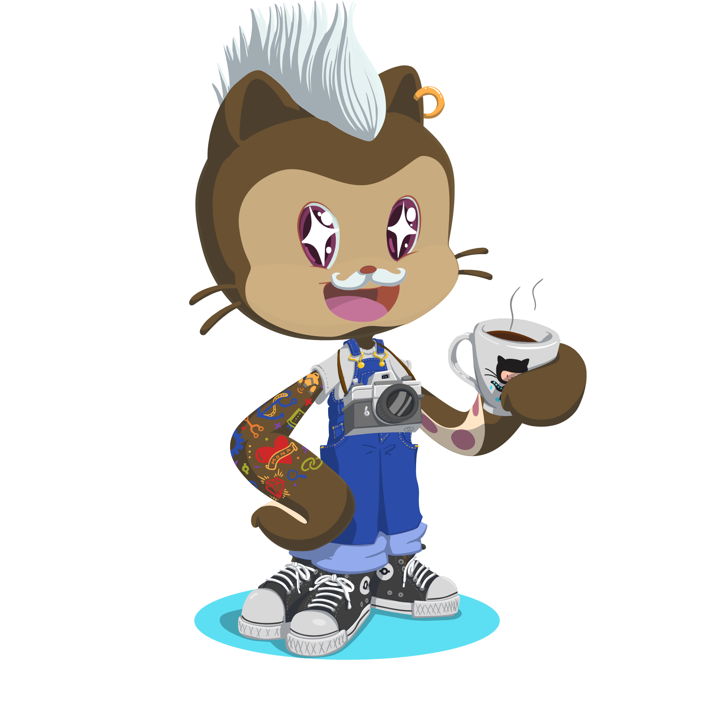

### <samp>Hey! 🤘 </samp>

<samp> :peach: My name is **Caroline**, **I'm a 98's kids**. </samp>  
<samp>An Information Systems student at FDB POA. </samp>
____________________________________________

- 🌱 I’m currently learning about Typescript, tests with   React and understanding better the concepts of OOP.  
In a near future, I want to study and work with React  Native too, but now I'm focus to study/work with web  
development, learn more about React and UX.

- 😄 Pronouns: She, Her.

- ⚡ Fun fact: I love writing and reading fantasy histories.

      

